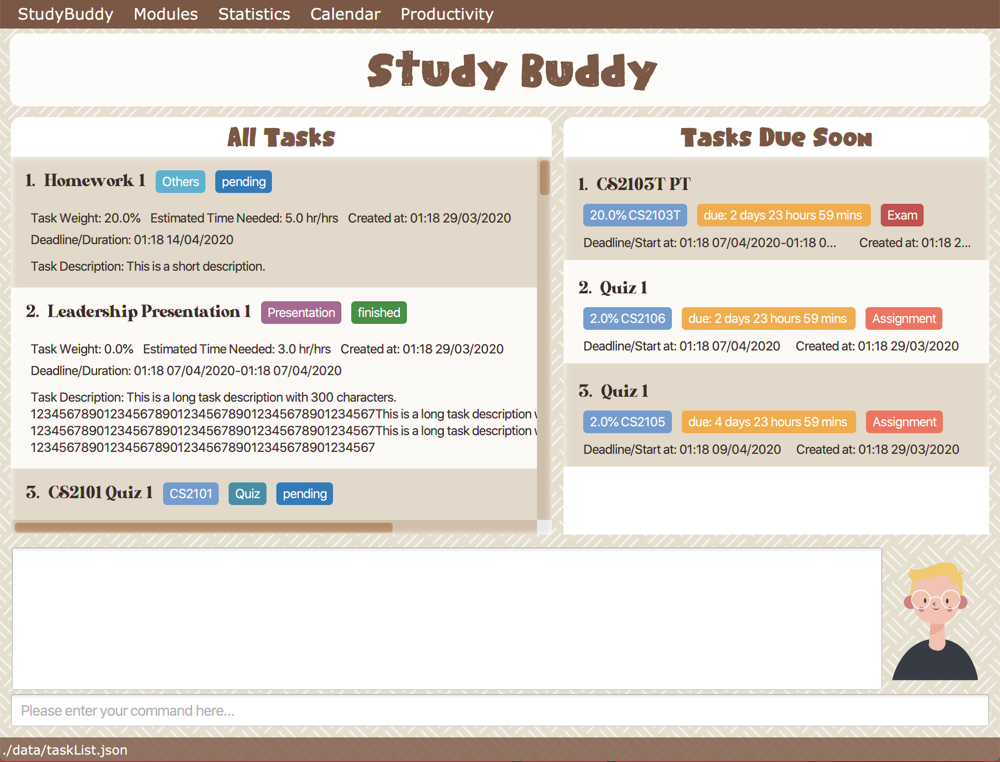

= StudyBuddy

== Introduction

ifdef::env-github,env-browser[:relfileprefix: docs/]

https://travis-ci.org/se-edu/addressbook-level3[image:https://travis-ci.org/AY1920S2-CS2103T-W16-3/main.svg?branch=master[Build Status]]

ifdef::env-github[]

endif::[]

ifndef::env-github[]
image::images/Ui.png[width="600", title="UI Sample Picture, will be updated in ther future"]
endif::[]

==== What is StudyBuddy ?

* StudyBuddy is a  task keeper for students who wish to manage their time more efficiently.
* With the help of StudyBuddy, students can easily manage and view their school tasks.
* Sort, filter and search commands are also provided to make the interaction more meaningful.
* It also provides services to show the statistics for time, grades breakdown and workload comparison between different
modules in Pie charts. With this visualisation of data, students can be more aware of their time management.

==== Who can benefit most from StudyBuddy ?

* It is designed for students who are able to type fast and comfortable with `Command-Line Interface(CLI)`.

==== What is CLI?
* CLI is a command line program that accepts text input to execute operating system functions.
* Compare with graphical user interfaces(GUI), CLI performs interaction with user by keyboard input instead of
mouse clicking, such as cmd window.

== Site Map
To browse more information, please check our site map:

* <<UserGuide#, User Guide>>
* <<DeveloperGuide#, Developer Guide>>
* <<AboutUs#, About Us>>
* <<ContactUs#, Contact Us>>

== Acknowledgements

* Some parts of this sample application were inspired by the excellent
http://code.makery.ch/library/javafx-8-tutorial/[Java FX tutorial] by
_Marco Jakob_.
* Libraries used: https://openjfx.io/[JavaFX],
https://github.com/FasterXML/jackson[Jackson], https://github.com/junit-team/junit5[JUnit5]

== Licence : link:LICENSE[MIT]
